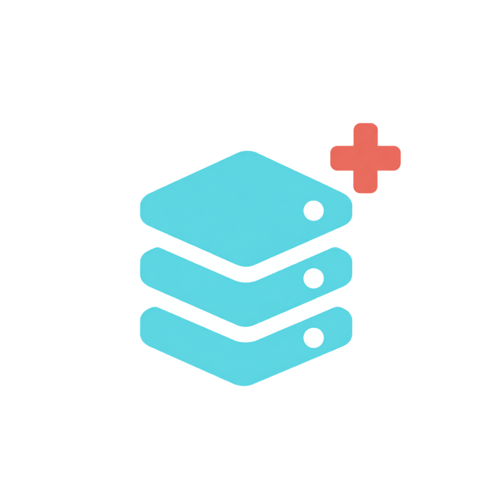
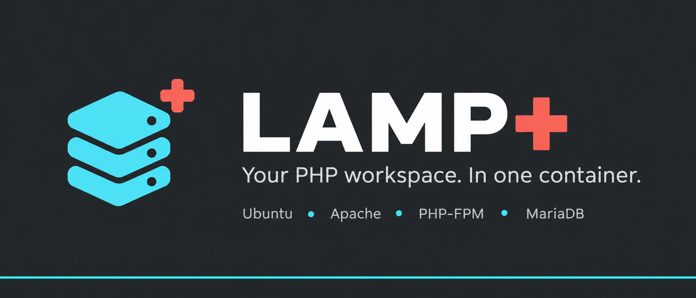
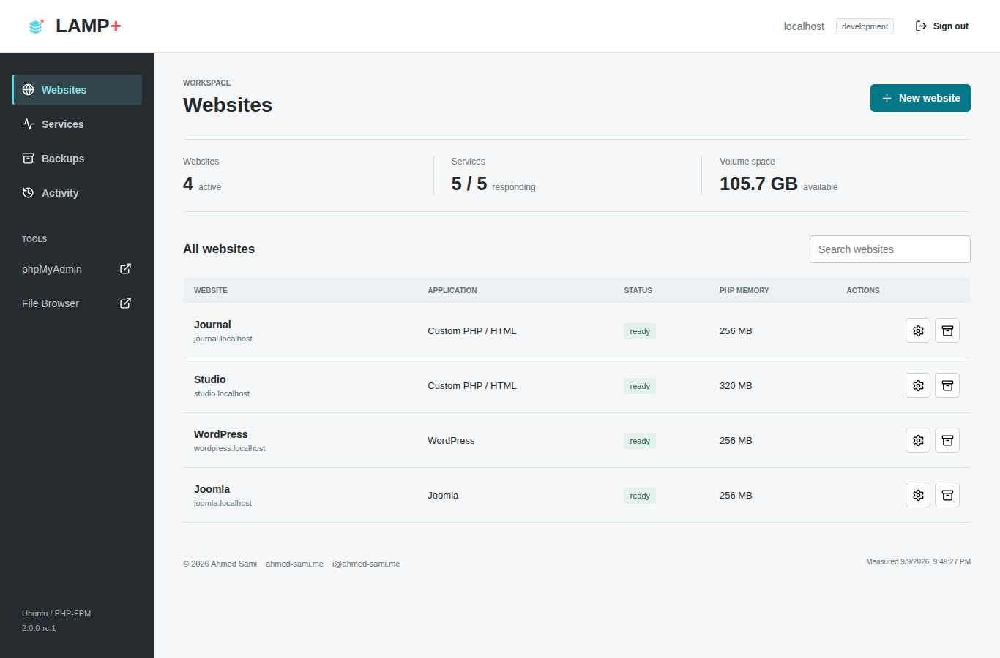

# LAMP+





An all-in-one Ubuntu container for PHP websites, with Apache, PHP-FPM, MariaDB,
an authenticated owner dashboard, phpMyAdmin and FileBrowser Quantum.

**2.0.0 is in development. This branch is not yet approved for public hosting.**
See [release readiness](docs/STATUS.md). No stable v2 image is claimed here.

Documentation: [HTTPS hosting](docs/HOSTING.md) | [Release procedure](docs/RELEASE.md)
| [Changelog](CHANGELOG.md) | [Contributing](CONTRIBUTING.md)

Project: [GitHub](https://github.com/ahmed-sami94/LAMP-) |
[Docker Hub](https://hub.docker.com/r/ahmedsamigmail/lampplus) |
[Project overview and page gallery](docs/PROJECT.md)

[Docker Hub overview source](docs/DOCKER_HUB.md)

## What changes in v2

- Multiple websites with individual databases, credentials and PHP-FPM pools.
- Protected WordPress and Joomla installation using checksum-pinned packages.
- First-boot secrets instead of shared default passwords.
- Persistent state, supervised services, health checks and graceful shutdown.
- Per-site PHP settings, backup schedules, retention and confirmed restoration.
- Maintained FileBrowser Quantum, with shell commands absent upstream.

This is a **single trusted owner's workspace**, not a security isolation platform
for unrelated tenants. Uploaded PHP runs inside the same container. Only install
code you trust. Administration and website content use separate hostnames.

## Dashboard



[Mobile screenshot](docs/screenshots/dashboard-mobile.png) |
[Tablet screenshot](docs/screenshots/dashboard-tablet.png) |
[Capture provenance](docs/screenshots/README.md)

## Local development

Prerequisites: Docker Engine with Compose v2, Linux containers, at least 2 GB RAM,
and enough storage for the image, databases and backups. Windows/macOS require
Docker Desktop or another Linux Docker runtime.

```sh
git clone https://github.com/ahmed-sami94/LAMP-.git
cd LAMP-
git switch release/2.0.0
cp .env.example .env
```

Edit `.env`: set `LAMP_ADMIN_PASSWORD` to a unique password of at least 16
characters, and copy `ubuntu` from `dependencies.lock.json` to `UBUNTU_IMAGE`.
Never commit `.env` or put credentials in screenshots or issue reports.

```sh
docker compose up --build -d
docker compose ps
```

Open [localhost:8080](http://localhost:8080), sign in as `admin`, and create
`studio.localhost`. Visit it at `http://studio.localhost:8080`. Add local host-file
entries when your browser/OS does not resolve `*.localhost` to loopback.

## Configuration and persistence

| Setting | Meaning |
| --- | --- |
| `LAMP_ADMIN_HOST` | Exact lowercase administration hostname; default `localhost` |
| `LAMP_ADMIN_USER` | Initial owner username; default `admin` |
| `LAMP_ADMIN_PASSWORD` | Required first-boot unique secret; no default |
| `LAMP_ADMIN_PASSWORD_FILE` | Alternative mounted secret file; do not set both |
| `LAMP_MODE` | `development` for localhost HTTP; `hosting` requires trusted HTTPS proxy |
| `LAMP_TRUSTED_PROXIES` | Explicit comma-separated proxy IP/CIDR allowlist for hosting |
| `LAMP_HTTP_PORT` | Localhost published port in development Compose; default `8080` |
| `LAMP_PUBLIC_PORT` | External website port used by CMS installers; Compose sets this from `LAMP_HTTP_PORT` |
| `UBUNTU_IMAGE` | Exact base reference from the dependency lock |

The provided development Compose uses an environment secret. A hosting example
with mounted secrets and Caddy is included. Both Compose examples and the Caddy
HTTPS boundary are covered by native Linux CI; image publication is still pending.

| Volume | Container path | Contents |
| --- | --- | --- |
| `sites` | `/srv/sites` | Website content, CMS config, temporary files and sessions |
| `database` | `/var/lib/mysql` | Managed MariaDB data |
| `state` | `/var/lib/lampplus` | Private owner account, site records, tool state and configuration |
| `backups` | `/var/backups/lampplus` | Private file archives, logical SQL exports and manifests |

Keep all four volumes together. A restart does not reset credentials. Changing
the initial password environment variable does not reset an existing account.
Never use `docker compose down -v` unless you intend to delete persistent data.

## Websites and tools

Use **New website** for an empty PHP/HTML site, WordPress, or Joomla. CMS installs
require unique administrator credentials and an email. Progress and failures
appear in **Activity**. Failed files are retained and never activated. Inspect
the reported path before retrying. Retrying a failed hostname allocates a fresh
directory and database, preserving the failed attempt. Nothing is installed over
an occupied destination.

Use **Settings** for PHP memory, uploads, execution time and daily backup retention.
Only ready websites are eligible for backup and settings operations.

- `/phpmyadmin/`: requires panel sign-in, then the website's own database account.
  Root login and arbitrary database servers are disabled.
- `/filebrowser/`: requires panel sign-in; filesystem scope is website content.
- `/mo`: opens the protected dashboard, replacing the legacy host monitor.

MariaDB and File Browser have **no published ports**. The old database port and
File Browser port 8080 exposure are removed. Do not publish their internal ports.

Owner CLI commands (replace the site ID with one shown by `status`):

```sh
docker compose exec app lampctl status
docker compose exec app lampctl credentials s0123456789ab
docker compose exec app lampctl composer s0123456789ab install --no-dev
docker compose exec app lampctl wp s0123456789ab plugin list
```

Credentials are displayed only in an interactive owner terminal. Composer and
WP-CLI drop privileges to the selected website's Unix account.

## Backups and restore

Use **Back up** for a logical database export and website archive. Scheduled
backups run approximately every 24 hours when enabled. Retention is 1–30 recovery
points. Copy backups off the host: a volume on the same host is not disaster recovery.
Avoid editing files or running background writers during backups; file and SQL
snapshots are not a distributed transaction.

Restore selects an existing recovery point for its original site and requires
typing that site's exact hostname. A pre-restore backup is mandatory. PHP-FPM is
briefly stopped during restoration, affecting PHP on all sites. Links and special
files in restore archives are refused. Uploaded arbitrary archives are not accepted.

## Legacy migration

Do **not** attach an unknown or legacy MariaDB directory. Export each old database
logically, create a fresh v2 workspace and website, transfer application files,
then import SQL using that site's database user. Update application connection
settings. Test routing, logins, uploads and backups before moving DNS. Keep the
old installation and verified exports until migration is accepted.

## Development and verification

```sh
python3 -m pip install flask requests
python3 -m unittest discover -s tests -p 'test_*.py' -v
```

GitHub Actions builds and tests native `linux/amd64` and `linux/arm64`. Live tests
require a disposable Docker host. Never run the test suite against production
volumes. Dependency versions and checksums are in `dependencies.lock.json`;
installed Ubuntu package versions are recorded at `/opt/lampplus/packages.txt`.

## Security and licensing

Report vulnerabilities using [SECURITY.md](SECURITY.md). GPLv3 applies to LAMP+;
bundled third-party components retain their own licenses. See
[third-party notices](THIRD_PARTY_NOTICES.md) and [LICENSE](LICENSE).

## Author

Copyright (c) 2026 **Ahmed Sami**. Developed and maintained by Ahmed Sami.

[i@ahmed-sami.me](mailto:i@ahmed-sami.me) |
[ahmed-sami.me](https://ahmed-sami.me/) | [Copyright notice](COPYRIGHT.md)
