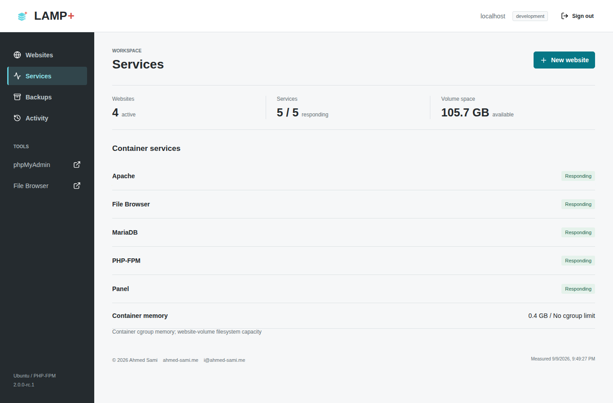
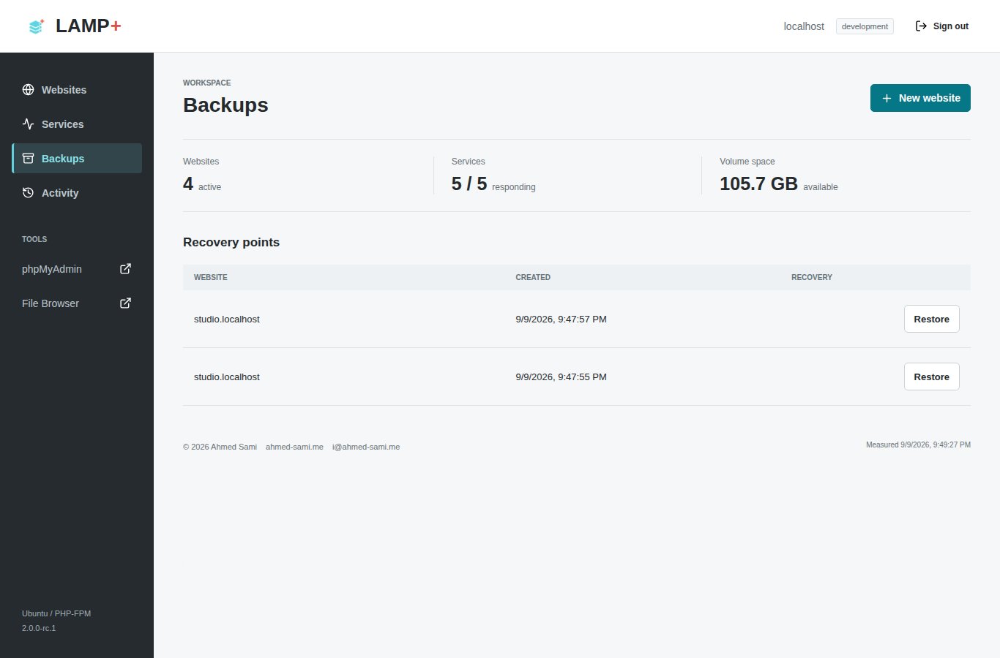
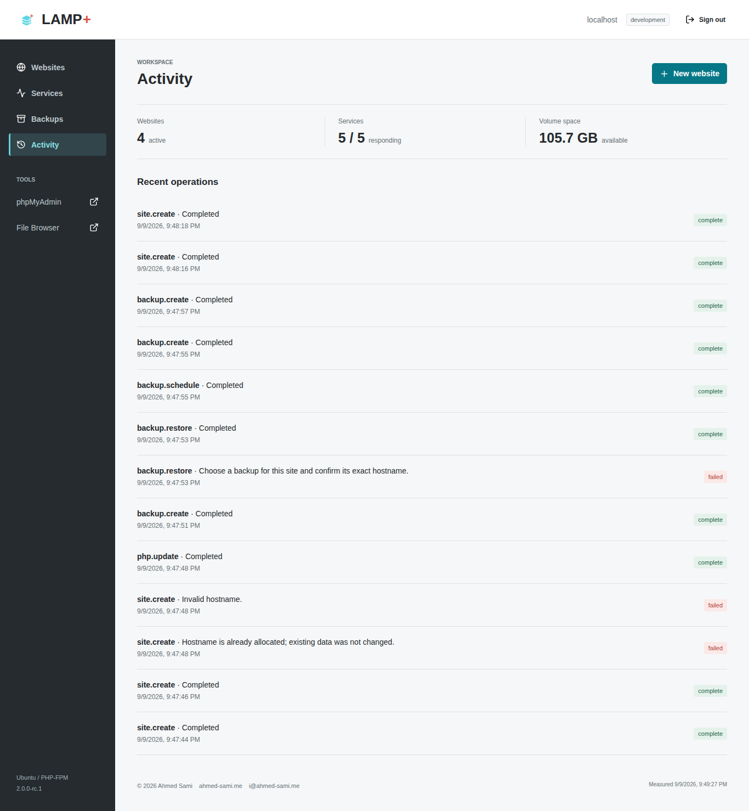
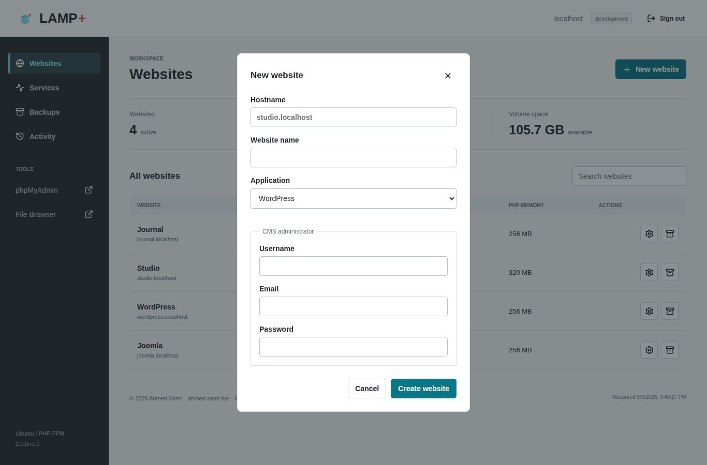
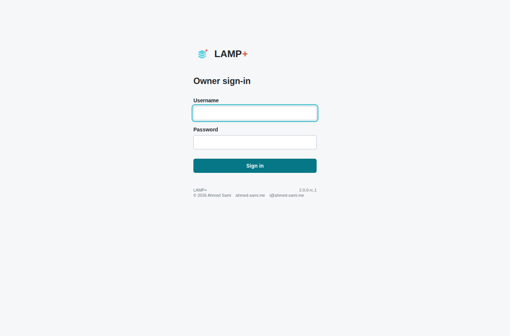

# LAMP+ Project Overview

## Description

LAMP+ brings PHP website development and small-site administration into one
Ubuntu container. Apache, PHP-FPM and MariaDB run alongside an authenticated
owner dashboard, phpMyAdmin and FileBrowser Quantum. Websites have their own
database credentials, document roots and PHP settings.

Copyright (c) 2026 **Ahmed Sami**. Developed and maintained by Ahmed Sami.
[i@ahmed-sami.me](mailto:i@ahmed-sami.me) | [ahmed-sami.me](https://ahmed-sami.me/).

Licensed under GPLv3, with component licenses documented
in [third-party notices](../THIRD_PARTY_NOTICES.md).

**Release status:** the v2 source is available for review and testing. A stable
Docker image has not been published. Native AMD64 and ARM64 acceptance results
are linked in [release readiness](STATUS.md).

[Source code](https://github.com/ahmed-sami94/LAMP-) |
[Docker Hub repository](https://hub.docker.com/r/ahmedsamigmail/lampplus) |
[Setup and configuration](../README.md)

## What Is Included

| Area | Capabilities |
| --- | --- |
| Websites | Multiple hostnames, separate databases and PHP-FPM pools |
| CMS setup | WordPress and Joomla installers with pinned package checksums |
| Administration | Hashed passwords, login throttling, CSRF checks and private state |
| PHP | Per-site memory, upload and execution limits; Composer and WP-CLI |
| Recovery | Manual and daily backups, retention and confirmed restoration |
| Operations | Supervised services, health checks, activity history and container metrics |
| Tools | Protected phpMyAdmin and FileBrowser Quantum on the admin hostname |
| Hosting | Caddy HTTPS example, mounted secrets and persistent volumes |

LAMP+ is for one trusted owner. It is not a tenant-isolation platform: uploaded
PHP shares the container, and restoring a site briefly stops PHP for all sites.
Keep off-host backups and use only trusted applications.

## Page Gallery

These images show the running application with synthetic websites, not mockups.
See [capture details](screenshots/README.md) for the source commit and CI evidence.

### Websites

Review websites, application types, status and per-site actions.

### Services

Inspect service health and container-scoped resource measurements.

### Backups

Review recovery points and select an explicit site for restoration.

### Activity

Follow provisioning, configuration and backup operations.

### Website Setup

Choose an empty site, WordPress or Joomla. CMS credentials are entered privately;
the screenshot leaves all credential fields empty.

### Sign In

Administration requires the owner's configured account; there is no shared password.

### Mobile And Tablet

[Mobile dashboard](screenshots/dashboard-mobile.png) |
[Tablet dashboard](screenshots/dashboard-tablet.png)

## Start And Contribute

Follow the [README quick start](../README.md#local-development) to build locally.
For domains and TLS, use the [HTTPS hosting guide](HOSTING.md). Legacy installations
require file transfer and logical SQL export/import into fresh volumes.

Read [contribution guidance](../CONTRIBUTING.md) before submitting changes.
Report security issues privately using [SECURITY.md](../SECURITY.md).
